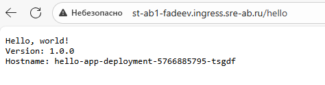

# Домашнее задание 3

Для удобства вся работа с kubectl вынесена в makefile.

## Развёртывание приложений

### Развёртывание hello-app

```bash
kubectl apply -f ./hello-app/
```

**Вывод:**

```bash
deployment.apps/hello-app-deployment created
ingress.networking.k8s.io/hello-app-ingress created
service/hello-app-service created
```

### Развёртывание whoami-app

```bash
kubectl apply -f ./whoami-app/
```

**Вывод:**

```bash
configmap/whoami-app-config created
deployment.apps/whoami-app-deployment created
ingress.networking.k8s.io/whoami-app-ingress created
service/whoami-app-service created
```

## Проверка ресурсов

```bash
kubectl get deploy,po,svc,ing,cm -o wide
```

### Deployments:

```bash
NAME                                    READY   UP-TO-DATE   AVAILABLE   AGE   CONTAINERS   IMAGES               
                 SELECTOR
deployment.apps/hello-app-deployment    1/1     1            1           62s   hello-app    gcr.io/google-samples/hello-app:1.0   app=hello-app
deployment.apps/whoami-app-deployment   1/1     1            1           61s   whoami-app   nginx:1.12           
                 app=whoami-app
```

### Pods:

```bash
NAME                                         READY   STATUS    RESTARTS   AGE   IP            NODE               
         NOMINATED NODE   READINESS GATES
pod/hello-app-deployment-5766885795-zgd6l    1/1     Running   0          62s   10.99.10.20   cl1bu2bntvqfdd7t5m3d-esuc   <none>           <none>
pod/whoami-app-deployment-76bfb9d65d-8sfcf   1/1     Running   0          61s   10.99.0.136   cl1bu2bntvqfdd7t5m3d-egyr   <none>           <none>
```

### Services:

```bash
NAME                         TYPE        CLUSTER-IP     EXTERNAL-IP   PORT(S)   AGE   SELECTOR
service/hello-app-service    ClusterIP   10.100.12.38   <none>        80/TCP    61s   app=hello-app
service/whoami-app-service   ClusterIP   10.100.20.14   <none>        80/TCP    61s   app=whoami-app
```

### Ingresses:

```bash
NAME                                           CLASS   HOSTS                             ADDRESS       PORTS   AGE
ingress.networking.k8s.io/hello-app-ingress    nginx   st-ab1-fadeev.ingress.sre-ab.ru   10.128.0.32   80      61s
ingress.networking.k8s.io/whoami-app-ingress   nginx   st-ab1-fadeev.ingress.sre-ab.ru   10.128.0.32   80      61s
```

### ConfigMaps:

```bash
NAME                          DATA   AGE
configmap/kube-root-ca.crt    1      21d
configmap/whoami-app-config   1      61s
```

## Проверка работы приложений через Ingress

### hello-app:

**Запрос:**

```bash
curl -v http://st-ab1-fadeev.ingress.sre-ab.ru/hello
```

**Ответ:**

```bash
* Host st-ab1-fadeev.ingress.sre-ab.ru:80 was resolved.
* IPv6: (none)
* IPv4: 10.128.0.32
*   Trying 10.128.0.32:80...
* Connected to st-ab1-fadeev.ingress.sre-ab.ru (10.128.0.32) port 80
* using HTTP/1.x
> GET /hello HTTP/1.1
> Host: st-ab1-fadeev.ingress.sre-ab.ru
> User-Agent: curl/8.14.1
> Accept: */*
>
* Request completely sent off
< HTTP/1.1 200 OK
< Date: Wed, 08 Oct 2025 19:00:06 GMT
< Content-Type: text/plain; charset=utf-8
< Content-Length: 77
< Connection: keep-alive
<
Hello, world!
Version: 1.0.0
Hostname: hello-app-deployment-5766885795-zgd6l
```

### whoami-app:

**Запрос:**

```bash
curl -v http://st-ab1-fadeev.ingress.sre-ab.ru/whoami
```

**Ответ:**

```bash
* Host st-ab1-fadeev.ingress.sre-ab.ru:80 was resolved.
* IPv6: (none)
* IPv4: 10.128.0.32
*   Trying 10.128.0.32:80...
* Connected to st-ab1-fadeev.ingress.sre-ab.ru (10.128.0.32) port 80
* using HTTP/1.x
> GET /whoami HTTP/1.1
> Host: st-ab1-fadeev.ingress.sre-ab.ru
> User-Agent: curl/8.14.1
> Accept: */*
>
* Request completely sent off
< HTTP/1.1 200 OK
< Date: Wed, 08 Oct 2025 19:00:14 GMT
< Content-Type: text/plain
< Content-Length: 30
< Connection: keep-alive
<
You are Fadeev Roman from AB-1
```

## Удаление ресурсов

```bash
kubectl delete -f ./hello-app/

kubectl delete -f ./whoami-app/
```

**Вывод:**

```bash
deployment.apps "hello-app-deployment" deleted from st-ab1-fadeev namespace
ingress.networking.k8s.io "hello-app-ingress" deleted from st-ab1-fadeev namespace
service "hello-app-service" deleted from st-ab1-fadeev namespace

configmap "whoami-app-config" deleted from st-ab1-fadeev namespace
deployment.apps "whoami-app-deployment" deleted from st-ab1-fadeev namespace
ingress.networking.k8s.io "whoami-app-ingress" deleted from st-ab1-fadeev namespace
service "whoami-app-service" deleted from st-ab1-fadeev namespace
```

## Скриншоты работы приложений

### hello-app:



### whoami-app:

